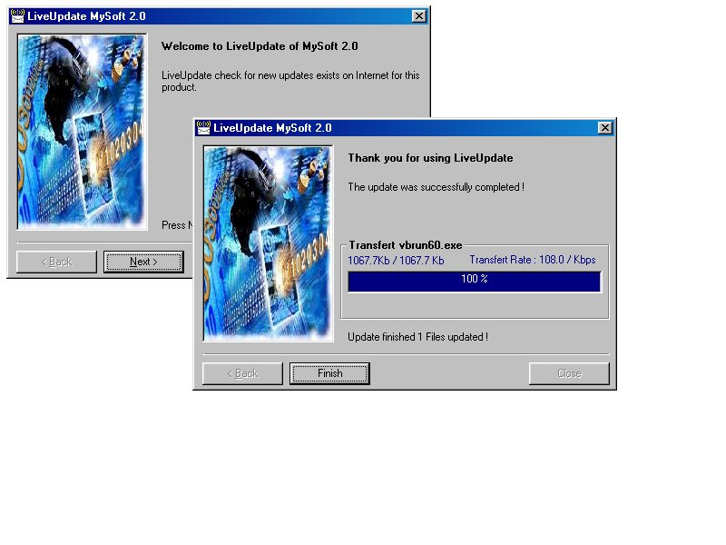



## LiveUpdate

### Description

This application update your application with a FTP site, (like Norton) just enter Application name of your software on ini files and the ftp.zzz.com/user/pass of your FTP site . The application compare the local and FTP date of the files and update only if FTP was more recent. after complete update you can execute the updated files by EXECUTE line command on the ini files.

You must See !!  Enjoy
 
### More Info
 

             |
---                |---
**Submitted On**   |2001-02-21 17:11:12
**By**             |[Robert Simard](https://github.com/Planet-Source-Code/PSCIndex/blob/master/ByAuthor/robert-simard.md)
**Level**          |Intermediate
**User Rating**    |4.8 (19 globes from 4 users)
**Compatibility**  |VB 6\.0
**Category**       |[Complete Applications](https://github.com/Planet-Source-Code/PSCIndex/blob/master/ByCategory/complete-applications__1-27.md)
**World**          |[Visual Basic](https://github.com/Planet-Source-Code/PSCIndex/blob/master/ByWorld/visual-basic.md)
**Archive File**   |[CODE\_UPLOAD153062212001\.zip](https://github.com/Planet-Source-Code/robert-simard-liveupdate__1-21224/archive/master.zip)

